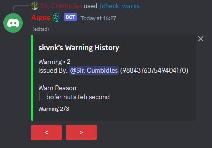

# BDFD JSON Warn History Guide
- [/warn](#warn)
  - [/warn Variables](#warn-variables)
  - [/warn Command Code](#warn-code)
- [/check-warns](#check-warns)
  - [/check-warns Variables](#check-warns-variables)
  - [/check-warns Command Code](#check-warns-code)
- [End Result](#end-result)

## /warn
The first step to creating a Json List is making a variable for it, we are going to name this variable `warnings` and set the value of it to `{"warns":"0"}` now that you have that sorted we are going to make a command to warn a user. <br>
The way a JSON List works is each warning is marked with a number `1, 2, 3, 4, etc..` and the value `{"warns":"0"}` we added before we tally how many warns there is. We then make a `/check-warns <user` command that will be able to display 1 warning per page which will be explained after `/warn`.
We will now make this simple command that will add a warn to the user using our JSON List.
### /warn Variables
`Name: warnings` <br>
`Value: {"warns":"0"}`
### /warn Code
Now firstly we will need to make a command called `warn` add to `required` options one option will be `user` set as a user option, and our second option is `reason` set as a text option. <br>
We will now make this simple command that will add a warn to the user using our JSON List.
```
$jsonParse[$getVar[warnings;$message[user]]]
$jsonSetString[warns;$calculate[$json[warns]+1]]
$var[warning;$json[warns]]
$jsonSetString[w-$var[warning];R;$message[reason]]
$jsonSetString[w-$var[warning];I;$authorID]
$setVar[warnings;$jsonStringify;$message[user]]

$title[<@$message[user]> Warned]
$description[> Warning Number: $var[warning]
> Warning Reason: $message[reason]
]
```
## /check-warns
Now we are going to setup a command to check the users warns. Now we will make a slash command called `check-warns` with one option named `user` set this as a user option.
### /check-warns Variables
Now we are going to need one more JSON Variable, so make a new variable and call it `warnPage` and set the value to `{}`. <br>
`Name: warnPage` <br>
`Value: {}`
### /check-warns Code
Now we are going to add this code to our `/check-warns <user>` command.
```
$nomention
$jsonParse[$getVar[warnings;$message[user]]]
$var[pages;$json[warns]]
$var[page;1]
$var[reason;$json[w-$var[page];R]]
$var[moderator;$json[w-$var[page];I]]
$jsonParse[$getVar[warnPage;$message[user]]]
$jsonSetString[page;1]
$jsonSetString[pages;$var[pages]]
$jsonSetString[user;$message[user]]
$setVar[warnPage;$jsonStringify;$authorID]
$title[<@$message[user]>'s Warning History]
$color[FF044]
$description[Warning - $var[page]
Issued By: <@$var[moderator]> ($var[moderator])

Warn Reason: $var[reason]]
$footer[Warning $var[page]/$var[pages]]
$addButton[no;prev-$authorID;<;danger;yes;]
$if[$var[pages]>1] $addButton[no;next-$authorID;>;danger;no;]
$else $addButton[no;next-$authorID;>;danger;yes;]
$endif
```
### /check-warns Interaction
Now to get the pages to work we are going to add this interaction which will cycle the page variable from `1, 2, 3, 4.. etc` or backwards if going back in the pages.
```
$nomention
$if[$customID==next-$authorID]
$removeButtons
$jsonParse[$getVar[warnPage;$authorID]]
$var[user;$json[user]]
$var[page;$calculate[$json[page]+1]]
$jsonSetString[page;$var[page]]
$setVar[warnPage;$jsonStringify;$authorID]
$jsonParse[$getVar[warnings;$var[user]]]
$var[pages;$json[warns]]
$var[reason;$json[w-$var[page];R]]
$var[moderator;$json[w-$var[page];I]]

$title[$username[$var[user]]’s Warning History]
$color[FF044]
$description[Warning • $var[page]
Issued By: <@$var[moderator]> ($var[moderator])

Warn Reason: 
> $var[reason]]
$footer[Warning $var[page]/$var[pages]]
$addButton[no;prev-$authorID;<;danger;no;]
$if[$var[page]<$var[pages]] $addButton[no;next-$authorID;>;danger;no;]
$else $addButton[no;next-$authorID;>;danger;yes;]
$endif
$endif

$if[$customID==prev-$authorID]
$removeButtons
$jsonParse[$getVar[warnPage;$authorID]]
$var[user;$json[user]]
$var[page;$calculate[$json[page]-1]]
$jsonSetString[page;$var[page]]
$setVar[warnPage;$jsonStringify;$authorID]
$jsonParse[$getVar[warnings;$var[user]]]
$var[pages;$json[warns]]
$var[reason;$json[w-$var[page];R]]
$var[moderator;$json[w-$var[page];I]]

$title[$username[$var[user]]’s Warning History]
$color[FF044]
$description[Warning • $var[page]
Issued By: <@$var[moderator]> ($var[moderator])

Warn Reason: 
> $var[reason]]
$footer[Warning $var[page]/$var[pages]]
$if[$var[page]==1] $addButton[no;prev-$authorID;<;danger;yes;]
$else $addButton[no;prev-$authorID;<;danger;no;]
$endif
$if[$var[page]<$var[pages]] 
$addButton[no;next-$authorID;>;danger;no;]
$else 
$addButton[no;next-$authorID;>;danger;yes;]
$endif
$endif
```
# End Result
<br>

